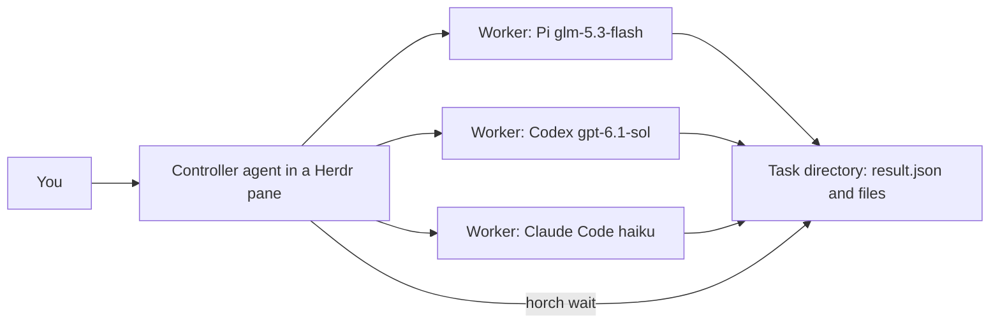

# herdr-pstack-orchestrator

Two skills for [Herdr](https://herdr.dev), the terminal multiplexer for coding agents. They turn one agent — the controller — into a dispatcher that starts worker agents in visible Herdr panes, gives each worker exactly one self-contained task, and reads the files the worker returns. Workers can run different harnesses and models side by side: a fast model writes the code, a different model reviews it.

- **herdr-orchestrator** — the core skill. Delegates work to Pi, Codex CLI, and Claude Code workers through a small CLI (`horch`), with first-use setup, setup checks, task states, and problem handling.
- **pstack-herdr** — optional. If you also run pstack, it routes pstack's delegation and review loop through the same Herdr workers instead of native subagents.

Workers open in tabs labeled `horch` (at most four panes per tab) without stealing focus, work in their own git worktrees, and end every task with a `result.json` you can inspect. The controller never types into a worker pane and never reuses one: every follow-up is a fresh task.

## Requirements

- [Herdr](https://herdr.dev) 0.9.3 or later, with the controller agent running inside a Herdr pane (`HERDR_ENV=1`)
- Python 3.11 or later (standard library only) for `horch`
- The harnesses you want as workers — `pi`, `codex`, and/or `claude` — installed and authenticated with your provider
- For the review loop only: pstack installed separately (see [Credits](#credits)); the two skills are installed independently of each other and of pstack

## Install

```bash
npx skills add conscientiousness/herdr-pstack-orchestrator -s herdr-orchestrator
# optional, for pstack review loops:
npx skills add conscientiousness/herdr-pstack-orchestrator -s pstack-herdr
```

Or clone and run directly:

```bash
git clone https://github.com/conscientiousness/herdr-pstack-orchestrator.git
cd herdr-pstack-orchestrator
python3 skills/herdr-orchestrator/scripts/horch.py detect
```

To make the skills discoverable by your agent, symlink them into its skills directory — for example `~/.claude/skills/` for Claude Code or `~/.pi/agent/skills/` for Pi:

```bash
ln -s "$PWD/skills/herdr-orchestrator" ~/.claude/skills/herdr-orchestrator
```

`horch` is a plain script; everywhere below, `horch` abbreviates `python3 <skill-dir>/scripts/horch.py`. Commands: `run`, `wait`, `list`, `close`, `detect` (installed harnesses and versions), and `check` (starts each worker once on a tiny task and reports whether it works). Every command prints JSON; an error is one `{"error": ..., "message": ...}` object with exit status 1.

## Quickstart

Paste this to your agent inside Herdr:

```text
Set up the herdr-orchestrator skill with me: run horch detect, ask me which
workers to define (harness, model, effort, and permission flags), write my
workers.toml, then run horch check and show me which workers are ok.
```

Once setup is done, delegation is one sentence:

```text
Use herdr-orchestrator to fix the login redirect loop in this repository:
create a git worktree, delegate the fix to a worker, and have a worker on a
different model review the diff before you report back.
```

## Configuration

`horch` reads `~/.config/herdr-orchestrator/workers.toml` (`$XDG_CONFIG_HOME` is respected). Copy the complete example from this repository and edit it:

```bash
mkdir -p ~/.config/herdr-orchestrator
cp skills/herdr-orchestrator/references/workers.example.toml \
   ~/.config/herdr-orchestrator/workers.toml
```

The example defines one worker per harness:

| Worker | Harness | Model and effort |
|---|---|---|
| `glm` | Pi | provider `zai`, `glm-5.3-flash`, thinking `max` |
| `gpt` | Codex | `gpt-6.1-sol`, reasoning `medium` |
| `haiku` | Claude Code | `haiku`, effort `max` |

Model names are examples — what you can use depends on the providers you authenticated. Pi lists its models with `pi --list-models`.

**Permissions.** A worker that stops at a permission prompt stays stuck, because the controller never answers dialogs. The flags you configure are your authorization for that worker, so prefer automatic approval modes. These flags completed real worker tasks without permission prompts on 2026-10-09:

| Harness | Arguments |
|---|---|
| Pi | none needed (no prompts by default) |
| Codex | `-s workspace-write -a on-request -c approvals_reviewer="auto_review"` |
| Codex | `-s workspace-write -a never` (writes in its cwd and the task directory) |
| Claude Code | `--permission-mode auto` |
| Claude Code | `--permission-mode acceptEdits` (shell commands outside the project can still prompt) |

Automatic approval can deny an action; denial handling is unverified (see [Verification](#verification)). The first run in a new location can also stop at trust dialogs — see [Troubleshooting](#troubleshooting).

Other keys: `max_active_workers` (default 4), `notify_after_minutes` (default 180), and the optional `[roles]` table for pstack (below). Task directories live under `~/.local/state/herdr-orchestrator/tasks/` (`$XDG_STATE_HOME` is respected) and keep every brief and result until you delete them.

## How delegation works



A worked example, one step at a time. First a disposable checkout, so the worker cannot tangle your branch:

```bash
git -C ~/src/myapp worktree add ~/src/myapp-fix-login -b fix/login
```

Then a brief that stands alone — the worker sees none of your conversation. State the goal, what to read first, what it may change, how to verify, and which files to write:

```markdown
# Fix the login redirect loop

After sign-in the app bounces back to /login instead of the page the user
came from.

- Read src/auth/session.ts and src/routes/login.ts first.
- Change only files under src/auth/ and src/routes/.
- Verify with npm test -- auth and npm run e2e -- login; both must pass.
- Commit on the current branch with a message explaining the cause.
- Write report.md next to result.json: cause, fix, verification output.
```

`horch` appends the worker rules and the `result.json` format to every brief, so do not add them yourself.

Start the worker and wait:

```bash
horch run gpt --brief /tmp/fix-login.md --cwd ~/src/myapp-fix-login
# prints JSON with task_id, pane_id, and state

horch wait t-0a1b2c   # returns when at least one waited task changes state
```

`horch wait` has no timeout — tasks can run for hours. Call it again while the state is `running`; with Codex and Pi controllers pass `--max-seconds 45` so you can post progress between waits. When the task is `done`, read `result.json` and the files it lists (their paths are relative to the result file's directory). To run tasks in parallel, make one `horch run` per task first, then wait on all the IDs.

## Task states and result status

`horch wait` and `horch list` report task states:

| State | Meaning |
|---|---|
| `running` | The worker is working. |
| `long_running` | Passed `notify_after_minutes`; reported once. |
| `done` | Turn ended with a valid `result.json`; the pane was closed. |
| `blocked`, `start_failed`, `not_started`, `exited`, `result_missing`, `result_invalid` | Problems; the pane stays open for inspection. |

`done` is a delivery receipt, not a verdict: it says the worker's turn ended and `result.json` matches this task. The `status` field inside — `completed`, `blocked`, or `failed` — is the worker's own claim. Neither approves the code. Read the diff, run the tests, or hand the work to a second worker on a different model before you trust it.

## Optional: the pstack review loop

If you run pstack, the `pstack-herdr` skill routes its delegation through your configured workers. Map pstack roles to workers in `workers.toml`:

```toml
[roles]
"feature, refactoring" = "gpt"
"interrogate reviewers" = ["glm", "haiku"]
```

A single role names one worker; a panel role lists one worker per review task. The review loop then runs end to end through `horch`: an implementation worker in a git worktree, the same read-only review brief sent to every reviewer, lead synthesis of their reports, and — after any accepted finding — a fresh implementation worker and a fresh reviewer panel on the new revision. Reviewer sessions are never reused, and a `done` reviewer task is never treated as a passing review.

## Verification

Measured during development on 2026-10-09 with end-to-end behavior tests:

| Area | Result |
|---|---|
| `horch` core behavior tests | 65/65 passed |
| First-use setup flow | 14/14 passed |
| Claude Code controller, skill end-to-end | 19/19 passed |
| Claude Code controller, pstack review loop end-to-end | 21/21 passed — the first reviewer panel FAILed the revision, and a fresh second panel PASSed it |
| Codex and Pi as workers | Starting and completing real tasks verified; their full controller loops are not yet tested |
| Permission-denial handling | Unverified |
| Completions longer than 30 minutes | Unverified |
| pstack workflows other than the review loop (for example Arena) | Not tested |
| Controller runtimes other than Claude Code | Not tested |

Model names throughout are examples; availability depends on your provider.

## Troubleshooting

| Symptom | What to do |
|---|---|
| `{"error": "not_in_herdr"}` | `horch` runs only inside a Herdr pane (`HERDR_ENV=1`). |
| `{"error": "config_invalid"}` | `workers.toml` is missing or invalid at the config path; copy `workers.example.toml`. |
| `worker_limit` on `horch run` | `max_active_workers` tasks still have open panes; close finished or problem tasks with `horch close <task-id>`. |
| Worker stops at a dialog (`blocked` / `start_failed`) | Trust dialogs are cleared once per location, by you in the pane: Codex asks "Trust this folder?" for each new git repository, and Claude Code asks to trust folders and about external `CLAUDE.md` imports. The controller never answers them. Afterwards run `horch close <task-id>` and start a new task. |
| Claude Code prompts when reading config or task directories | Add `~/.config/herdr-orchestrator` and `~/.local/state/herdr-orchestrator` to `permissions.additionalDirectories` in your Claude Code settings. |
| `result_missing` / `result_invalid` | The turn ended without a valid `result.json`, often after a provider API error. Start a new task with the same brief. |
| A task runs very long | `horch` has no timeout; you are notified once after `notify_after_minutes`. Keep waiting, or close the task and start a fresh one with a narrower brief. |

## Contributing

Issues and pull requests are welcome.

- **Bug reports**: include the JSON output of the failing `horch` command, the matching lines from `horch list`, and the harness versions from `horch detect`.
- **Tests**: this project has no unit test suite. Every change is verified with end-to-end behavior tests against real harnesses, so describe in your pull request which end-to-end scenarios your change affects. The public end-to-end test path will be added to this repository.
- **Scope**: the product is two skills and one CLI script; keep changes small and behavior-focused.

## Credits

- [Herdr](https://herdr.dev) — the terminal multiplexer for coding agents that hosts every worker pane; `horch` drives its CLI.
- pstack — original pstack by Lauren Tan (poteto), MIT, in the [cursor/plugins](https://github.com/cursor/plugins) repository. The `pstack-herdr` skill maps its workflows onto Herdr via the [pstack-claude](https://github.com/michael-denyer/pstack-claude) port by Michael Denyer.

## License

Not chosen yet.
