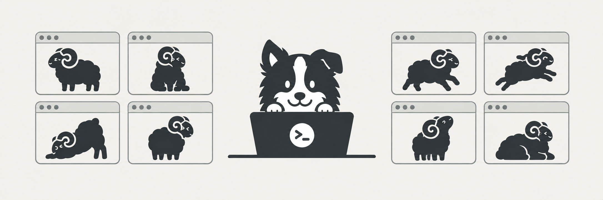
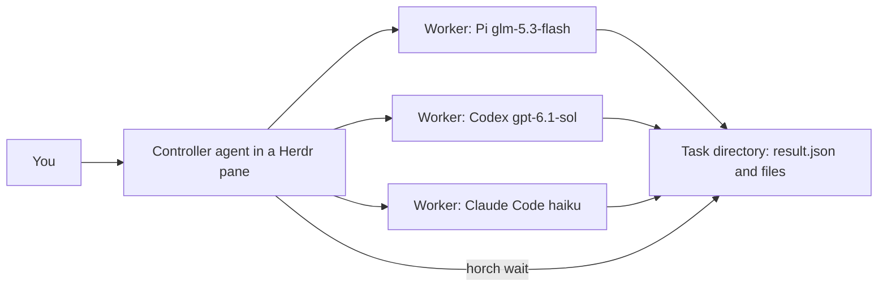

<picture>
  <source media="(prefers-color-scheme: dark)" srcset="assets/banner-dark.png">
  <source media="(prefers-color-scheme: light)" srcset="assets/banner-light.png">
  
</picture>

# herdr-pstack-orchestrator

[](https://github.com/conscientiousness/herdr-pstack-orchestrator/actions/workflows/validate.yml)
[](LICENSE)

**Run a visible team of coding agents from one conversation.** One model implements, other models review, and you can inspect every worker in [Herdr](https://herdr.dev).

Two Agent Skills connect your controller to Pi, Codex CLI, and Claude Code. Each task gets a fresh process, a complete brief, and a structured result. The `horch` CLI uses Python's standard library; no server or API integration is required beyond Herdr and your existing agent subscriptions or provider accounts.

- **herdr-orchestrator** — the core skill. Delegates work to Pi, Codex CLI, and Claude Code workers through a small CLI (`horch`), with first-use setup, setup checks, task states, and problem handling.
- **pstack-herdr** — optional. If you also run pstack, it routes pstack's delegation and review loop through the same Herdr workers instead of native subagents.

Workers open in tabs labeled `horch` (at most four panes per tab) without stealing focus. The controller creates separate git worktrees for writers and submits tasks through Herdr's agent API. Every follow-up starts a fresh worker.

## Requirements

- [Herdr](https://herdr.dev) 0.9.3 or later, with the controller agent running inside a Herdr pane (`HERDR_ENV=1`)
- Python 3.11 or later on Linux or macOS (standard library only, including POSIX file locks)
- Node.js/npm for `npx skills add`; a manual clone needs neither
- The harnesses you want as workers — `pi`, `codex`, and/or `claude` — installed and authenticated with your provider
- For the review loop only: pstack installed separately (see [Credits](#credits)); the two skills are installed independently of each other and of pstack

## Install

```bash
npx skills add conscientiousness/herdr-pstack-orchestrator -s herdr-orchestrator
# optional, for pstack review loops:
npx skills add conscientiousness/herdr-pstack-orchestrator -s pstack-herdr
```

Open a new agent session inside Herdr so it can discover the installed skills.

Or clone and run directly:

```bash
git clone https://github.com/conscientiousness/herdr-pstack-orchestrator.git
cd herdr-pstack-orchestrator
python3 skills/herdr-orchestrator/scripts/horch.py detect
```

To make the skills discoverable by your agent, symlink them into its skills directory — for example `~/.claude/skills/` for Claude Code or `~/.pi/agent/skills/` for Pi:

```bash
mkdir -p ~/.claude/skills
ln -s "$PWD/skills/herdr-orchestrator" ~/.claude/skills/herdr-orchestrator
```

`horch` is a plain script. For the manual examples below, define this shell function from the clone:

```bash
HORCH_SCRIPT="$PWD/skills/herdr-orchestrator/scripts/horch.py"
horch() { python3 "$HORCH_SCRIPT" "$@"; }
```

Commands: `run`, `wait`, `list`, `close`, `detect` (installed harnesses and versions), and `check` (starts each worker once on a tiny task and reports whether it works). Operational output is JSON; errors use `{"error": ..., "message": ...}` and exit status 1. CLI help and argument errors use normal argparse output.

## Quickstart

Paste this to your agent inside Herdr:

```text
Set up the herdr-orchestrator skill with me: run horch detect, ask me which
workers to define (harness, model, effort, and permission flags), write my
workers.toml, then run horch check and show me which workers are ok.
```

Once setup is done, delegation is one sentence:

```text
Use herdr-orchestrator to fix the login redirect loop in this repository:
create a git worktree, delegate the fix to a worker, and have a worker on a
different model review the diff before you report back.
```

## Configuration

`horch` reads `~/.config/herdr-orchestrator/workers.toml` (`$XDG_CONFIG_HOME` is respected). Copy the complete example from this repository and edit it:

```bash
mkdir -p ~/.config/herdr-orchestrator
cp -i skills/herdr-orchestrator/references/workers.example.toml \
   ~/.config/herdr-orchestrator/workers.toml
```

The example defines one worker per harness:

| Worker | Harness | Model and effort |
|---|---|---|
| `glm` | Pi | provider `zai`, `glm-5.3-flash`, thinking `max` |
| `gpt` | Codex | `gpt-6.1-sol`, reasoning `medium` |
| `haiku` | Claude Code | `haiku`, effort `max` |

Model names are examples — what you can use depends on the providers you authenticated. Pi lists its models with `pi --list-models`.

**Permissions.** The controller never answers worker dialogs. Choose each worker's permission flags deliberately. These modes completed real tasks without prompts on 2026-10-09:

| Harness | Arguments |
|---|---|
| Pi | none needed (no prompts by default) |
| Codex | `-s workspace-write -a on-request -c 'approvals_reviewer="auto_review"'` |
| Codex | `-s workspace-write -a never` (writes in its cwd and the task directory) |
| Claude Code | `--permission-mode auto` |
| Claude Code | `--permission-mode acceptEdits` (shell commands outside the project can still prompt) |

Automatic approval can deny an action; denial handling is unverified (see [Verification](#verification)). The first run in a new location can also stop at trust dialogs — see [Troubleshooting](#troubleshooting).

Other keys: `max_active_workers` (default 4), `notify_after_minutes` (default 180), and the optional `[roles]` table for pstack (below). Task directories live under `~/.local/state/herdr-orchestrator/tasks/` (`$XDG_STATE_HOME` is respected) and keep every brief and result until you delete them. Processes sharing a task store serialize worker startup to enforce the limit; workers then execute concurrently.

## How delegation works



A manual example: first create a separate checkout and branch for the writer. A worktree separates edits; it is not a security sandbox.

```bash
git -C ~/src/myapp worktree add ~/src/myapp-fix-login -b fix/login
```

Then a brief that stands alone — the worker sees none of your conversation. State the goal, what to read first, what it may change, how to verify, and which files to write:

```markdown
# Fix the login redirect loop

After sign-in the app bounces back to /login instead of the page the user
came from.

- Read src/auth/session.ts and src/routes/login.ts first.
- Change only files under src/auth/ and src/routes/.
- Verify with npm run e2e -- login, including a return URL and an expired session.
- Commit on the current branch with a message explaining the cause.
- Write report.md next to result.json: cause, fix, verification output.
```

`horch` appends the worker rules and the `result.json` format to every brief, so do not add them yourself.

Start the worker and wait:

```bash
horch run gpt --brief /tmp/fix-login.md --cwd ~/src/myapp-fix-login
# prints JSON with task_id, pane_id, and state

horch wait t-0a1b2c --max-seconds 45  # use the task_id returned by run
```

`horch wait` has no timeout — tasks can run for hours. Call it again while the state is `running`; with Codex and Pi controllers pass `--max-seconds 45` so you can post progress between waits. When the task is `done`, read `result.json` and the files it lists (their paths are relative to the result file's directory). To run tasks in parallel, make one `horch run` per task first, then wait on all the IDs.

## Task states and result status

`horch wait` and `horch list` report task states:

| State | Meaning |
|---|---|
| `running` | The worker is working. |
| `long_running` | Passed `notify_after_minutes`; reported once. |
| `done` | Turn ended with a valid `result.json`; check `closed` and `message` for pane cleanup. |
| `blocked`, `start_failed`, `not_started`, `exited`, `result_missing`, `result_invalid` | Problems; the pane stays open for inspection. |

`done` is a delivery receipt, not a verdict: it says the worker's turn ended and `result.json` matches this task. The `status` field inside — `completed`, `blocked`, or `failed` — is the worker's own claim. Neither approves the code. Read the diff, run the tests, or hand the work to a second worker on a different model before you trust it.

Wait for `state: "done"` before consuming a result. A worker can write files while its turn is still running, so `horch wait` withholds result summaries, files, and questions until completion. Closing a running worker cancels it; it does not complete the task or satisfy a review gate.

## Optional: the pstack review loop

If you run pstack, the `pstack-herdr` skill routes its delegation through your configured workers. Map pstack roles to workers in `workers.toml`:

```toml
[roles]
"feature, refactoring" = "gpt"
"interrogate reviewers" = ["glm", "haiku"]
```

A single role names one worker; a panel role lists one worker per review task. The review loop then runs end to end through `horch`: an implementation worker in a git worktree, the same read-only review brief sent to every reviewer, lead synthesis of their reports, and — after any accepted finding — a fresh implementation worker and a fresh reviewer panel on the new revision. Reviewer sessions are never reused, and a `done` reviewer task is never treated as a passing review.

Ask your controller to use both `pstack-herdr` and pstack's `interrogate` workflow. The TOML roles are authoritative. Codex and Pi read them directly; Claude Code can import them from your user-owned `pstack-models.md`. See the [mapping and review-loop instructions](skills/pstack-herdr/SKILL.md). Read-only reviews are enforced by the brief and chosen harness permissions, not by a separate `horch` sandbox.

## Verification

Measured during development on 2026-10-09 with end-to-end behavior tests:

| Area | Result |
|---|---|
| `horch` core behavior tests | 65/65 passed again on the release candidate, across all three worker harnesses |
| First-use setup flow | 14/14 passed again on the release candidate |
| Parallel starts, cross-workspace cleanup, repeated waits, notification | 8/8 passed |
| Invalid results, explicit recheck, concurrent wait/close, corrupt records | 13/13 passed |
| Early result delivery, final completion, cancellation | 10/10 passed on the final CLI |
| Public six-task review-loop driver | 27/27 passed in 7m 19s, including two failing first reviews and two passing final reviews |
| Claude Code controller, skill end-to-end | 19/19 passed |
| Claude Code controller, pstack review loop end-to-end | 21/21 passed — the first reviewer panel FAILed the revision, and a fresh second panel PASSed it |
| Codex controller, full pstack review loop | 10/10 passed; direct TOML roles, six fresh workers, no native subagents |
| Codex and Pi as workers | Starting and completing real tasks verified |
| Permission-denial handling | Unverified |
| Completions longer than 30 minutes | Unverified |
| pstack workflows other than the review loop (for example Arena) | Not tested |
| Pi controller, full pstack review loop | 10/10 passed on the final CLI; direct TOML roles, six fresh workers, no native subagents |

Model names throughout are examples; availability depends on your provider.

The [verification summary](skills/herdr-orchestrator/references/verification.json) records versions, counts, source hashes, and limits. Core and setup runs predate the final completion-delivery change; the public loop and focused lifecycle check cover the final CLI. The [public E2E evidence](skills/herdr-orchestrator/references/review-e2e.json) contains the observed invoice outputs and every assertion. Live runtime tests used Linux; macOS has not been measured.

### Reproduce the review loop

From a clone inside Herdr, select one configured writer and two reviewers with different model definitions:

```bash
python3 skills/herdr-orchestrator/scripts/e2e.py \
  --writer gpt --reviewer glm --reviewer haiku \
  --repo . --output /tmp/horch-evidence
```

This makes real model calls and requires two free worker slots. It creates a detached worktree, plants two independent invoice defects, verifies a scoped implementation, requires both reviewers to find the remaining defect, then verifies a fresh fix and two fresh passing reviews. Additional CLI cases cover fractional discounts, full discounts, zero quantities, and single-line invoices.

The driver retains the worktree and writes `evidence.json` with task IDs, source hashes, revision IDs, CLI observations, and assertions. It cleans up only its own worker panes, including after failure. Reports stay in your local task store; transcripts are not copied into the evidence. Remove the retained checkout with `git worktree remove <printed-worktree-path>` when finished.

This public driver controls `horch` directly. Tests of an AI controller following the skills are recorded separately in the matrix above. GitHub Actions checks Python compatibility, configuration parsing, and installation into all three agents; real model E2Es run locally because they need Herdr and authenticated providers.

## Troubleshooting

| Symptom | What to do |
|---|---|
| `{"error": "not_in_herdr"}` | `horch` runs only inside a Herdr pane (`HERDR_ENV=1`). |
| `{"error": "config_invalid"}` | `workers.toml` is missing or invalid at the config path; copy `workers.example.toml`. |
| `worker_limit` on `horch run` | `max_active_workers` tasks still have open panes; close finished or problem tasks with `horch close <task-id>`. |
| Worker stops at a dialog (`blocked` / `start_failed`) | Trust dialogs are cleared once per location, by you in the pane: Codex asks "Trust this folder?" for each new git repository, and Claude Code asks to trust folders and about external `CLAUDE.md` imports. The controller never answers them. Afterwards run `horch close <task-id>` and start a new task. |
| Claude Code prompts when reading config or task directories | Add `~/.config/herdr-orchestrator` and `~/.local/state/herdr-orchestrator` to `permissions.additionalDirectories` in your Claude Code settings. |
| `result_missing` / `result_invalid` | Inspect the problem pane and task files. If the user wants a retry, close the old task and start a new one. |
| `not_started` | Herdr did not observe the prompt acknowledgement. The task may still be running. Inspect it before deciding; `horch wait <task-id> --recheck --max-seconds 45` checks the existing task again without resending anything. |
| `done` with `closed: false` | Read `message`, then retry cleanup with `horch close <task-id>`. The task still consumes a slot until closure is confirmed. |
| A task runs very long | `horch` has no timeout; you are notified once after `notify_after_minutes`. Keep waiting, or close the task and start a fresh one with a narrower brief. |

## Contributing

Issues and pull requests are welcome.

- **Bug reports**: include the error code, reproduction steps, and harness versions. Remove credentials, private paths, proprietary briefs, and full worker transcripts before posting.
- **Verification**: use real end-to-end behavior tests for complex changes. Include a reproducible scenario and sanitized evidence with your pull request. Start with the [public driver](skills/herdr-orchestrator/scripts/e2e.py); no unit test suite is required.
- **Scope**: the product is two skills, the CLI, and its reproducible E2E driver. Keep changes small and behavior-focused. Write code, documentation, and commit messages in English.

## Credits

- [Herdr](https://herdr.dev) — the terminal multiplexer for coding agents that hosts every worker pane; `horch` drives its CLI.
- The banner uses Herdr's ram icon as its visual reference. See the [generation prompt and provenance](assets/banner-prompt.md).
- pstack — original pstack by Lauren Tan (poteto), MIT, in the [cursor/plugins](https://github.com/cursor/plugins) repository. The `pstack-herdr` skill maps its workflows onto Herdr via the [pstack-claude](https://github.com/michael-denyer/pstack-claude) port by Michael Denyer.

## License

[MIT](LICENSE). Copyright 2026 conscientiousness and contributors.
